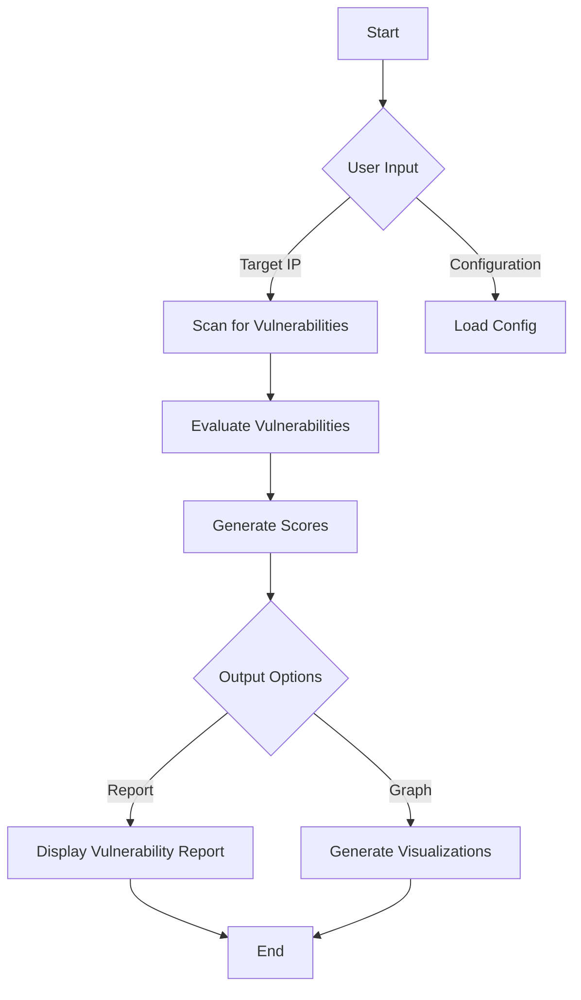

# Vulnerability Scoring Tool

## Introduction

The Vulnerability Scoring Tool is a Python-based application designed to assess and quantify vulnerabilities related to the Server Message Block (SMB) protocol. This tool provides users with an intuitive and comprehensive scoring system that helps in identifying and prioritizing vulnerabilities based on their severity and potential impact on systems.

This README outlines the features, installation steps, usage instructions, and a detailed overview of the data flow within the program, accompanied by charts and graphs for a better understanding of how the tool operates.

## Features

- **Vulnerability Assessment**: Scan for known vulnerabilities in SMB configurations.
- **Scoring System**: Calculate severity scores based on several metrics, such as CVSS (Common Vulnerability Scoring System).
- **User-Friendly Output**: Generate easy-to-understand reports highlighting critical vulnerabilities.
- **Data Visualization**: Visual representations of vulnerability data to aid in quick analyses and decision-making.
- **Modular Design**: Components can be easily modified or extended with additional vulnerability checks or scoring metrics.

## Installation

```markdown
To set up the Vulnerability Scoring Tool, follow the steps below:

1. **Clone the Repository**:
   ```bash
   git clone https://github.com/yourusername/vulnerability_scoring_tool.git
   cd vulnerability_scoring_tool
   ```

2. **Install Dependencies**:
   Ensure you have Python 3.x installed. Use pip to install the required packages:
   ```bash
   pip install -r requirements.txt
   ```

3. **Run the Tool**:
   Execute the scoring script:
   ```bash
   python vuln_score.py
   ```

## Usage

To use the Vulnerability Scoring Tool effectively, follow these steps:

1. **Initialize the Configuration**: 
   Edit the configuration file (e.g., `config.yaml`) to set parameters relevant to your SMB environment.
   
2. **Launch a Vulnerability Scan**: 
   Run the tool to start assessing your SMB vulnerabilities.
   ```bash
   python vuln_score.py --target <target_ip>
   ```

3. **Review Output**: 
   Upon completion, the tool will generate a report detailing the vulnerabilities found, their scores, and recommended mitigation strategies.

## Data Flow Overview

The data flow of the program is designed to process inputs from the user, scan systems, and output results. Below is a simplified diagram illustrating this flow:



### Charts and Graphs

The tool also provides visualizations to better understand the vulnerability landscape. Below are examples of the type of charts generated:

1. **Vulnerability Severity Distribution**
   This bar chart shows how many vulnerabilities fall into each severity category (Critical, High, Medium, Low).

   

2. **Total Vulnerabilities Found**
   A pie chart representing the proportion of vulnerabilities discovered during the scan.

   

3. **Trends Over Time**
   A line graph that tracks the number of vulnerabilities found over multiple scans, helping to identify trends.

   

## Contributing

Contributions are welcome! If you would like to add more features, improve documentation, or fix bugs, please fork the repository and create a pull request. 

## License

This project is licensed under the MIT License - see the [LICENSE](LICENSE) file for details.

## Acknowledgments

- Inspired by the SMB-Scor3 project and the principles laid out in vulnerability assessment methodologies.
- Special thanks to the open-source community for their valuable contributions and support.

---
]
