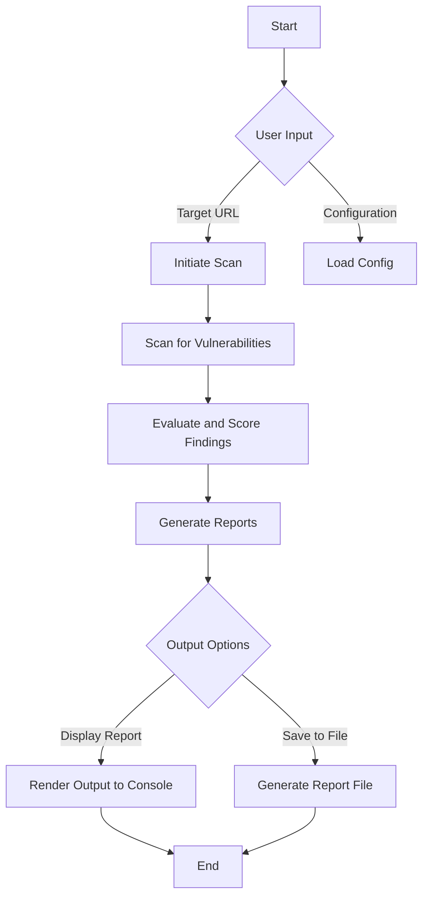

# 🌐 VulnR_ScannR: An Advanced Vulnerability Scanner & Grader 

## 📖 Introduction

**VulnR_ScannR** is a sophisticated Python-based vulnerability scanning tool designed to identify security weaknesses in systems and applications. With a focus on user-friendliness and comprehensive reporting, this tool aims to empower security professionals and enthusiasts to enhance their security posture effectively.

---

## 🚀 Features

- **🔍 In-Depth Scanning**: Analyze applications and systems for known vulnerabilities.
- **📊 Comprehensive Reports**: Generate detailed reports summarizing findings, including severity levels and mitigation recommendations.
- **⚙️ Modular Design**: Easily extendable framework for integrating new scanning techniques and modules.
- **🌟 User-Friendly Interface**: Intuitive command-line interface that simplifies the scanning process.
- **📈 Data Visualization**: Visual outputs to help interpret vulnerability data quickly.

---
```markdown
## 🛠️ Installation

### Prerequisites

- Python 3.6 or newer
- Pip (Python package installer)

### Installation Steps

1. **Clone the Repository**:
   ```bash
   git clone https://github.com/elithaxxor/VulnR_ScannR.git
   cd VulnR_ScannR
   ```

2. **Install Required Packages**:
   Install the necessary dependencies via pip:
   ```bash
   pip install -r requirements.txt
   ```

3. **Run the Scanner**:
   Execute the main scanning script to start analyzing your target:
   ```bash
   python main.py --target <target_ip_or_url>
   ```

---

## 👩‍💻 Usage

To utilize VulnR_ScannR, follow these steps:

### Step 1: Configure Your Environment

Before running the scanner, edit the configuration file `config.yaml` to adjust parameters such as scan depth and output preferences.

### Step 2: Launch the Scan

Run the scanner by specifying the target you want to analyze:
```bash
python main.py --target <target_ip_or_url>
```

### Step 3: Review the Outputs

Once the scanning process is complete, review the generated reports for a comprehensive overview of identified vulnerabilities.

---

## 📊 Data Flow Overview

The data flow of VulnR_ScannR can be summarized as follows:



---

## 📈 Visual Insights

The scanner provides visual representations to facilitate understanding of the results. Examples include:

1. **Vulnerability Severity Distribution**: A bar chart illustrating the quantity of vulnerabilities categorized by severity (Critical, High, Medium, Low).

   

2. **Total Vulnerabilities Found**: A pie chart portraying the percentage of detected vulnerabilities.

   

3. **Trends Over Time**: A line graph demonstrating the number of vulnerabilities discovered in consecutive scans.

   

---

## 🤝 Contributing

Contributions to VulnR_ScannR are highly encouraged! If you would like to enhance the tool, fix bugs, or add features:

1. **Fork the Repository**.
2. **Create a New Branch**.
3. **Make Your Changes**.
4. **Submit a Pull Request**.

---

## 📝 License

This project is open-source and available under the MIT License. See the [LICENSE](LICENSE) file for details.

---

## 🙏 Acknowledgments

- **Inspiration**: Special thanks to the open-source community for their continuous support and contributions.
- **Learning Resources**: Acknowledging various vulnerability assessment methodologies that informed this project.

---

## 📧 Contact

For any questions or inquiries, please feel free to reach out:

- **Email**: [your_email@example.com](mailto:your_email@example.com)
- **GitHub**: [YourGitHubProfile](https://github.com/YourGitHubProfile)

---

Let's make the web a safer place, one scan at a time! 🔐
```

### Notes:
- Replace `path_to_severity_distribution_chart.png`, `path_to_total_vulnerabilities_chart.png`, and `path_to_trends_over_time_chart.png` with the actual paths to your images or charts when you generate them.
- Update your email and GitHub profile placeholder text with your actual contact information.
- Feel free to customize any sections further to better match your tool's features and purpose!
